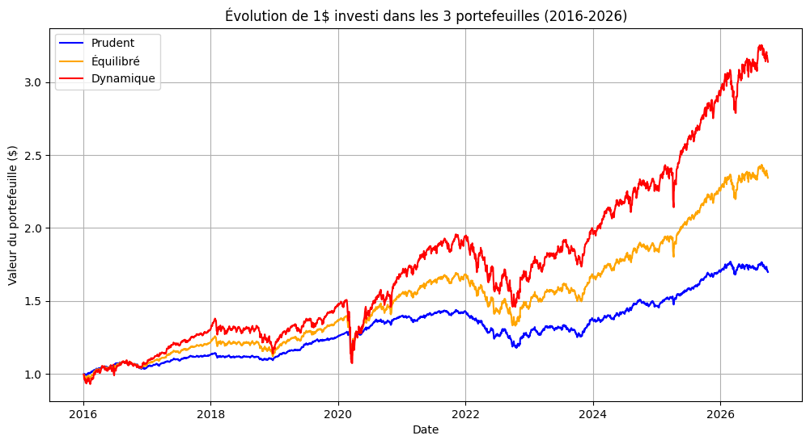

# Portfolio Risk Analysis & Stress Testing (2016–2026)

## Overview / Présentation
This quantitative finance project evaluates the risk and return profiles of three benchmark multi-asset portfolios (**Conservative**, **Balanced**, and **Dynamic**) constructed using ETFs across different asset classes.

The study measures tail risk, historical drawdowns, and portfolio resilience during major market disruptions, specifically the **March 2020 COVID-19 crash** and the **2022 inflationary rate-hike shock**.

## Asset Allocation & Portfolio Construction / Allocation d'actifs

Data was collected using the `yfinance` API covering daily adjusted closing prices from **January 2016 to September 2026**.

### 1. Underlying Assets / Actifs sous-jacents
* **URTH**: MSCI World ETF (Global Equities / Actions Mondiales)
* **EZU**: MSCI Eurozone ETF (European Equities / Actions Zone Euro)
* **AGG**: iShares Core U.S. Aggregate Bond ETF (U.S. Bonds / Obligations US)
* **GLD**: SPDR Gold Shares (Gold / Or)

### 2. Portfolio Profiles / Profils de portefeuille
* **Conservative (Prudent)**: 70% AGG | 15% URTH | 5% EZU | 10% GLD
* **Balanced (Équilibré)**: 40% AGG | 35% URTH | 15% EZU | 10% GLD
* **Dynamic (Dynamique)**: 10% AGG | 55% URTH | 25% EZU | 10% GLD

---

## Key Risk Metrics / Indicateurs de risque clés

| Metric / Indicateur | Conservative | Balanced | Dynamic |
| :--- | :---: | :---: | :---: |
| **Annualized Volatility / Volatilité annualisée** | **6.21%** | **9.86%** | **14.55%** |
| **1-Day Historical VaR (95%) / VaR Hist. 1j (95%)** | **0.58%** | **0.87%** | **1.32%** |
| **1-Day Parametric VaR (95%) / VaR Param. 1j (95%)** | **0.62%** | **0.99%** | **1.46%** |
| **Maximum Drawdown / Perte maximale** | **-18.18%** | **-21.43%** | **-28.85%** |

---

## Stress Testing & Scenario Analysis / Analyse de crise

> [!WARNING]
> **Scenario 1 — Liquidity Shock (COVID-19 Crash | Feb 19 – Mar 23, 2020)**
> - **Conservative:** `-8.73%` *(Strong fixed-income buffer)*
> - **Balanced:** `-19.03%`
> - **Dynamic:** `-28.53%` *(Severe drawdown driven by global equity sell-off)*

> [!CAUTION]
> **Scenario 2 — Inflation & Rate Hike Shock (Full Year 2022)**
> - **Conservative:** `-12.40%` *(Bond duration risk materialized)*
> - **Balanced:** `-13.59%`
> - **Dynamic:** `-15.17%` *(Cross-asset correlation converged to 1)*

---

## Key Limitations & Takeaways / Limites et enseignements
1. **FX Risk / Risque de change**: All tickers are USD-denominated without currency hedging back to EUR.
2. **Normality Assumption / Hypothèse de normalité**: Parametric VaR slightly overestimates 1-day tail risk compared to Historical VaR due to fat tails (kurtosis) in financial asset returns.

---

## Tech Stack / Technologies
* **Language**: Python
* **Libraries**: `yfinance`, `pandas`, `numpy`, `scipy`, `matplotlib`

